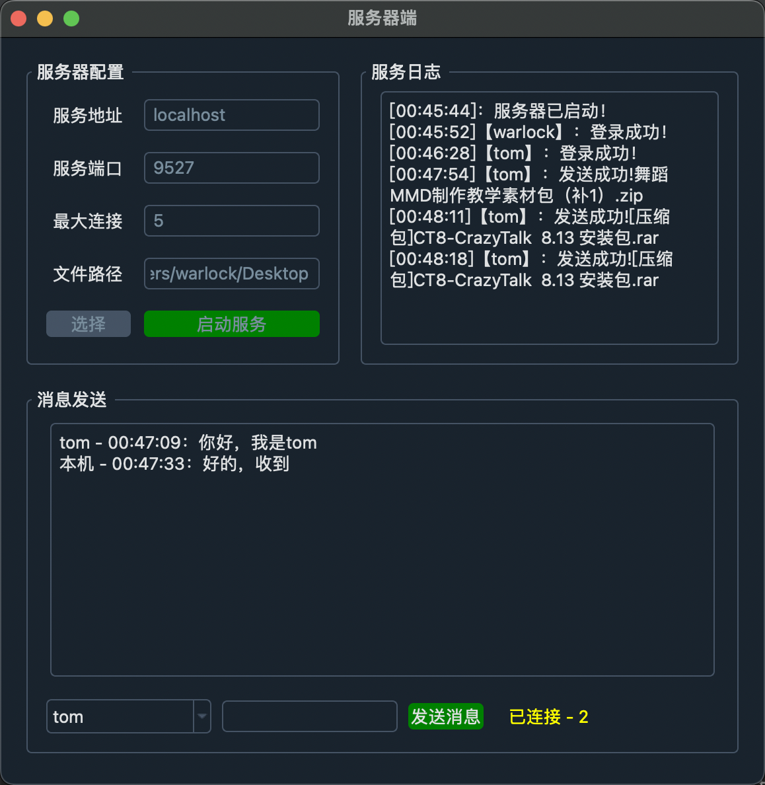
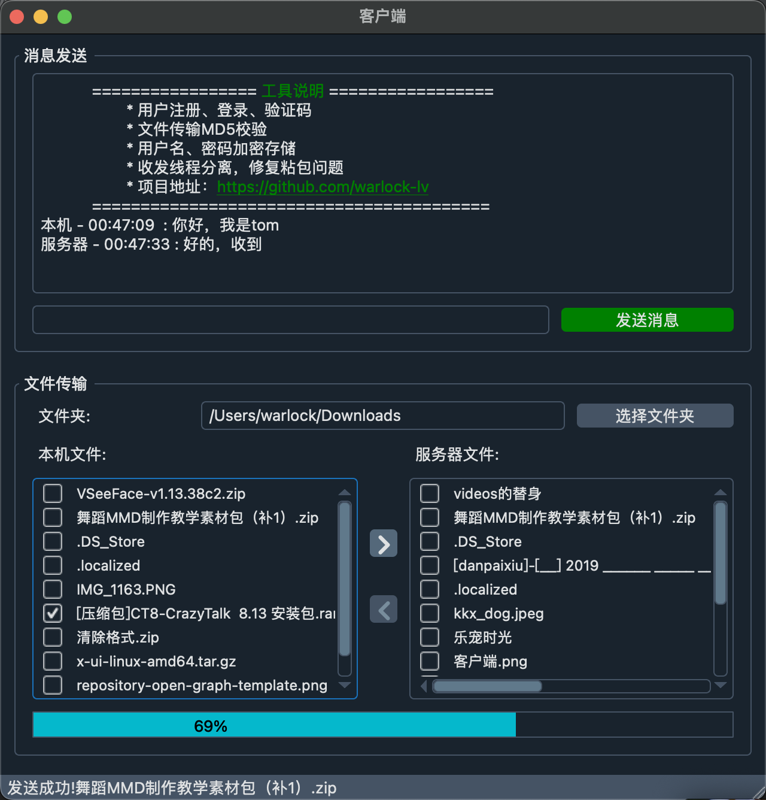

# pyqt5_tcp

> 一个基于PyQt5的TCP文件传输应用
> > 概述、界面绘制 、界面美化]、事件、信号与槽、PyQt5多线程、数据结构定义——解决TCP粘包问题、功能实现(注册/登录/消息/文件传输/服务日志)

## 应用功能
* 用户注册、登录  
* 文件传输、校验  
* 收发消息（打印）
* 服务日志（打印）

## 实验内容
了解应用编程接口API，掌握基于socket的网络编程的原理，开发利用socket的TCP文件传输应用程序。该应用需要具备的功能以及实现的要点描述如下：  
* 该程序应该包括服务器应用程序以及客户应用程序。
* 用户需要身份验证。即对于客户端来说，无论是上传文件，还是下载文件，首先需要做的事情是登陆服务器，得到服务器的验证。 若验证成功，即可与服务器之间开始传输文件。若验证失败，服务器则返回错误信息。错误信息包括，用户名错误，密码错误等。
* 理解文件传输的原理。所谓文件传输，对于发送端来说，实质是将数据读入发送缓存再将其发送。对于接收端来说，实质是从接收缓存里读取数据并将其写入到指定的位置。
* 请注意理解文件传输的含义。文件，指的是一切可以传输的信息，包括文本文件、图片文件、视频文件等。传输，指的是服务器和客户端都可以成为文件的发送者。从客户端的角度来说，客户端向服务器传送文件称为上传，服务器向客户端传送文件称为下载。

## 备注
* 本代码基于 [pynet 点击跳转](https://github.com/sangyx/pynet)
* 因为本人想开发个界面工具，所以借这个代码入门学习一下，感谢原作者sangyx
* Mac m1 的pyinstaller打包不能给 Mac intel 的使用，相反也一样，运行会报错：Error：Bad CPU type in executable

## 优化内容
- 代码风格，变量定义遵循pep8
- 部分可配置量 提取到config文件
- 初始运行服务端，创建数据表、初始用户
- 代码优化，面向对象封装，重新组织项目文件树
- 增加，只运行客户端时，提示"服务端未运行"界面
- 解决打包后找不到数据库文件、保存数据丢失问题
- 支持html样式文本显示，MyTextBrowser
- 美化进度条样式，MyProgressBar

## 打包命令
* > pyinstaller -w -F ./tcp_server.py --clean -i ./res/icons/icon3.icns --noconfirm
* > pyinstaller -w -F ./tcp_client.py --clean -i ./res/icons/icon3.icns --noconfirm
* > pyinstaller --clean --noconfirm ./tcp_server.spec
* > pyinstaller --clean --noconfirm ./tcp_client.spec

其他参数（按需求选择）：

* -F  表示在 dist 文件夹下只生成单个可执行文件（内部包含所有依赖），不加默认会在 dist 生成一大堆依赖文件+可执行文件。
* -D  与 -F 相反用法
* -w  表示去掉控制台窗口，如果你的程序是有界面的，可以不写这个参数。但是测试情况下建议先加上这个参数，因为如果打包不成功，运行时报错信息会在控制台上输出，没有控制台就看不到报错信息。
* -c  表示去掉窗框，使用控制台
* -p  表示自己定义需要加载的类路径，项目中包含多个自建模块的时候需要加上 -p aaa.py -p bbb.py -p ccc.py
* -i  表示可执行文件的图标，后面跟图标的路径
* --hidden-import  后面跟模块名如 queue，用于告诉打包程序某个模块我用不着你不用打包进去

## 打包成可以安装和卸载的程序：

* 打包Python程序：
> 使用PyInstaller或py2app等工具将你的Python程序打包成一个可执行文件或者一个文件夹。\
例如，可以使用以下命令来使用PyInstaller打包程序：\
pyinstaller -w -F ./main.py --clean -i ./icon.ico --noconfirm \
这个命令会创建一个名为main.exe（Windows）或main.app（macOS）的可执行文件。

* 创建安装程序：
> 需要使用一个安装程序制作工具，如Inno Setup（Windows）或Packages（macOS），\
来将可执行文件打包成一个安装程序。这个安装程序可以将你的可执行文件复制到用户的计算机上的指定位置，并创建必要的快捷方式和卸载程序。\
需注意的是，这个过程可能会有些复杂，因为你需要确保你的程序可以在不同的计算机和操作系统上正确运行。\
此外，如果你的程序依赖于其他的库或数据文件，你也需要确保这些文件被正确地包含在你的安装程序中。

## TODO
- 两端增加自定义端口功能
- 服务器增加停止服务功能
- 打包成dmg、msi可安装包

